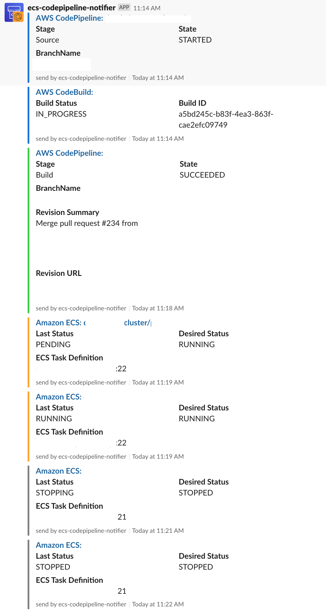
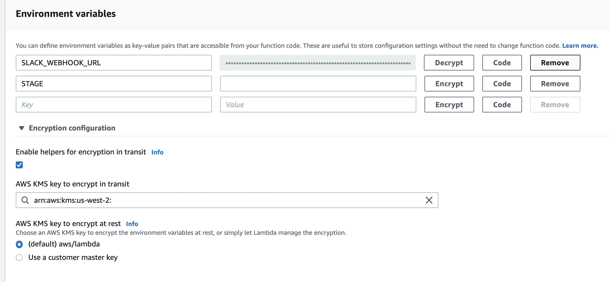

# ecs-codepipeline-slack-notifications

Lambda Function to post AWS Codepipeline, CodeBuild and ECS Sevice notifications to slack.

## Demo



## Requirement

- serverless 1.3x
- python 3.7

## Get Started

1. Create Slack incoming Webhook URL

2. Create env yaml from `./conf/env.yml.sample`

3. Install serverless-python-requirements plugin

```
$ sls plugin install -n serverless-python-requirements --stage dummy
```

4. Deploy to AWS

`YOUR-STAGE-NAME` is needed to match env yaml file name you created before.

```
$ sls deploy -v --stage YOUR-STAGE-NAWE
```

5. Encrypt Slack incoming webhook URL set with lambda's environment variable

   - Create key in KMS
     - Set lambda's role, `ecs-codepipeline-notifier-YOUR-STAGE-NAME...-lambdaRole` as Key Users
   - Set encrypt with lambda web console

     - Once you set, you don't need to set again every time you deploy

     

## Contribution

1. Fork this
2. Create your feature branch (git checkout -b my-new-feature)
3. Commit your changes (git commit -am 'Add some feature')
4. Push to the branch (git push origin my-new-feature)
5. Create new Pull Request
